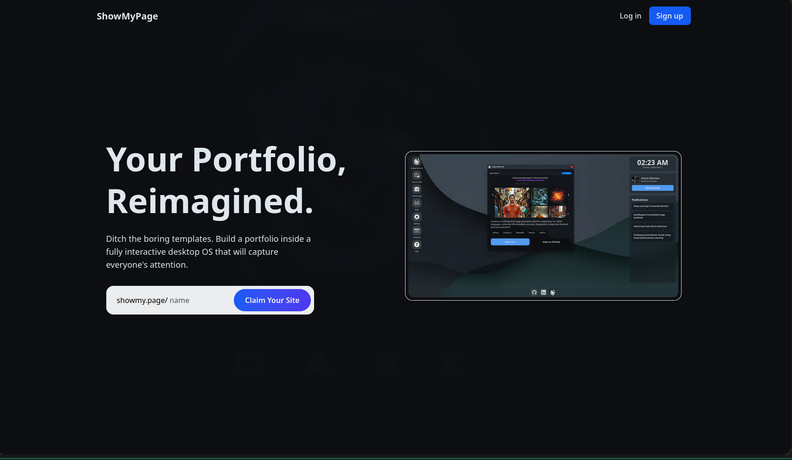
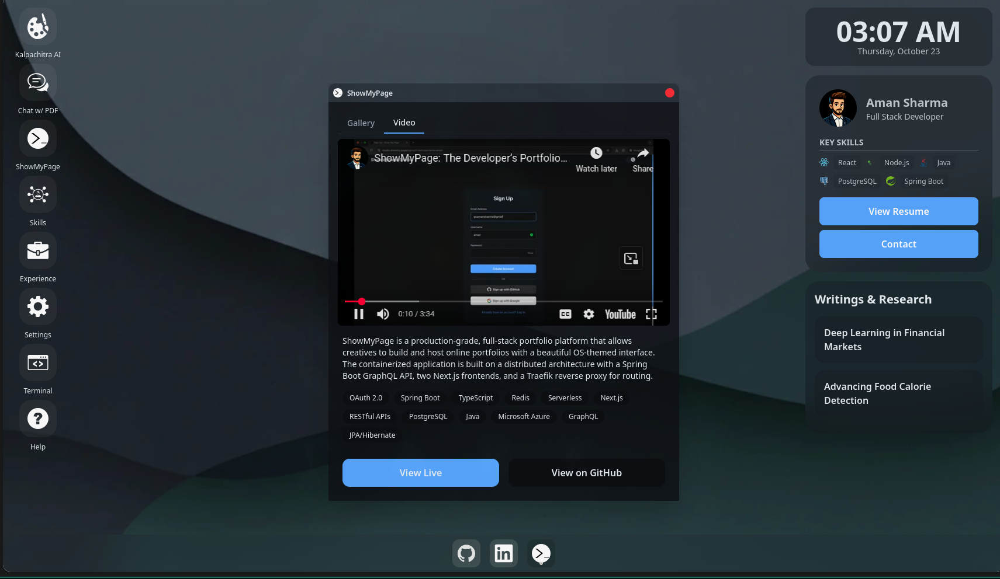
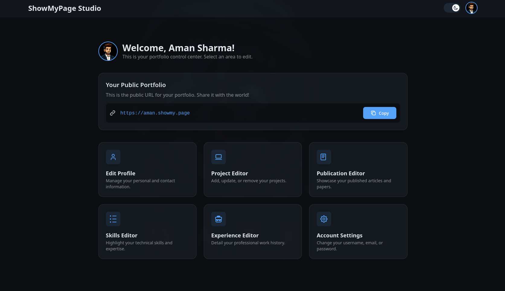

# ShowMyPage 🚀

> A production-grade, full-stack portfolio platform that empowers developers, designers, and creatives to build and host stunning online portfolios with a beautiful OS-themed interface.

[](https://showmy.page)
[](https://studio.showmy.page)
[](https://youtu.be/nV7HGw6t7V4)

## ✨ What Makes This Special

ShowMyPage isn't just another portfolio builder—it's a demonstration of **production-grade engineering** with modern architecture patterns, performance optimizations, and enterprise-level security. Built to showcase both your work and my full-stack development capabilities.

### 🎯 Key Features

- **Complete Portfolio Management** - Projects, work experience, publications, and skills in one place
- **Secure Authentication** - JWT sessions + OAuth 2.0 (Google & GitHub)
- **Password Management** - Full lifecycle support with email-based reset flows
- **Intuitive Studio** - Dedicated content management interface
- **Dynamic Public Profiles** - Beautiful portfolios at `showmy.page/username` and `username.showmy.page`
- **Smart Validation** - Case-insensitive checks and reserved username protection

## 📸 Screenshots

**Landing Page**



**Portfolio View**



**Studio Editor**


## 🏗️ Architecture

Built on a **containerized microservices-oriented architecture** designed for scalability and production deployment.

```
┌─────────────────────────────────────────────────┐
│              Traefik Reverse Proxy              │
│         (SSL Termination & Routing)             │
└────────┬──────────────┬─────────────┬───────────┘
         │              │             │
    ┌────▼────┐    ┌────▼────┐   ┌────▼───┐
    │ Public  │    │ Studio  │   │  API   │
    │ Next.js │    │ Next.js │   │ Spring │
    └─────────┘    └─────────┘   └────┬───┘
                                      │
                          ┌───────────┴──────────┐
                          │                      │
                     ┌────▼─────┐          ┌─────▼──────┐
                     │PostgreSQL│          │   Redis    │
                     │(Primary) │          │  (Cache)   │
                     └──────────┘          └────────────┘
```

## 🛠️ Tech Stack

| Category | Technology |
|----------|-----------|
| **Backend** | Java 17, Spring Boot 3, Spring Security, Spring Data JPA, GraphQL |
| **Frontend** | React, Next.js, TypeScript, Tailwind CSS |
| **Database** | PostgreSQL, Redis |
| **DevOps** | Docker, Docker Compose, Traefik, GitHub Actions |

## 💡 Technical Highlights

### 1. Solved the N+1 Query Problem
**Challenge:** Portfolio loading was slow due to multiple database queries for related entities.

**Solution:** Implemented JPA Entity Graphs and JOIN FETCH queries.

**Impact:** Reduced queries from O(N+1) to O(1), dramatically improving performance.

```java
@EntityGraph(attributePaths = {"projects", "skills", "experiences"})
Optional<User> findByUsername(String username);
```

### 2. Production-Ready Authentication
- **JWT-based security** for stateless, scalable API authentication
- **OAuth 2.0 integration** with Google and GitHub
- **BCrypt password hashing** and secure token-based reset flows
- **CSRF protection** and secure cookie handling

### 3. GraphQL API Design
Chose GraphQL over REST for:
- **Flexible data fetching** - clients request exactly what they need
- **Reduced payload sizes** - no over-fetching or under-fetching
- **Single endpoint** - simplified API surface

```graphql
query GetPortfolio($username: String!) {
  portfolio(username: $username) {
    user { name email bio }
    projects { title description techStack }
    skills { name level }
  }
}
```

### 4. Redis Caching Strategy
**Problem:** Frequently accessed portfolio data caused unnecessary database load.

**Solution:** Implemented distributed caching with Redis.

**Impact:** Near-instantaneous load times for cached portfolios with smart invalidation on updates.

### 5. Docker-Based Infrastructure
- **Full containerization** for consistency across environments
- **Traefik integration** for automatic SSL (Let's Encrypt) and routing
- **Multi-subdomain setup** with production-ready configuration

## 🚀 Quick Start

### Prerequisites
- Docker & Docker Compose
- Node.js 18+ (for local development)
- Java 17+ (for backend development)

### Running Locally

1. **Clone the repository**
   ```bash
   git clone git@github.com:gsamansharma/showmypage.git
   cd showmypage
   ```

2. **Set up environment variables**
   ```bash
   cp .env.example .env
   # Edit .env with your configuration
   ```

3. **Start the application**
   ```bash
   docker-compose -f docker-compose.dev.yml up --build
   ```

4. **Access the services**
   - 🌐 Public Portfolio: http://localhost:3000
   - 🎨 Studio: http://localhost:3001
   - 🔧 GraphQL Playground: http://localhost:8080/graphiql

## 📁 Project Structure

```
showmypage/
├── backend/              # Spring Boot application
│   ├── src/
│   │   ├── main/
│   │   │   ├── java/    # Java source code
│   │   │   └── resources/
│   │   └── test/        # Unit & integration tests
│   └── Dockerfile
├── frontend-public/      # Public portfolio (Next.js)
│   ├── src/
│   ├── components/
│   └── Dockerfile
├── frontend-studio/      # Studio interface (Next.js)
│   ├── src/
│   ├── components/
│   └── Dockerfile
├── docker-compose.dev.yml
├── docker-compose.prod.yml
└── traefik/             # Reverse proxy configuration
```

## 🔒 Security Features

- **Password Security:** BCrypt hashing with secure salt rounds
- **JWT Authentication:** Signed tokens with expiration
- **CORS Configuration:** Strict origin policies
- **SQL Injection Protection:** JPA prepared statements
- **XSS Prevention:** Input sanitization and validation
- **Rate Limiting:** API endpoint protection (via Traefik)

## 📊 Performance Metrics

- ⚡ **Cold Start:** < 500ms (with cache)
- 📦 **Bundle Size:** Optimized with code splitting
- 🗄️ **Database Queries:** Optimized with entity graphs
- 💾 **Cache Hit Rate:** ~85% for portfolio requests

## 👤 Author

**Aman Sharma**

- Portfolio: [amansharma.cv](https://amansharma.cv)
- GitHub: [@gsamansharma](https://github.com/gsamansharma)
- LinkedIn: [@gsamansharma](https://linkedin.com/in/gsamansharma)

## 🙏 Acknowledgments

Built with passion to demonstrate modern full-stack development practices and help creatives showcase their work beautifully.

---

⭐ Star this repo if you find it useful!